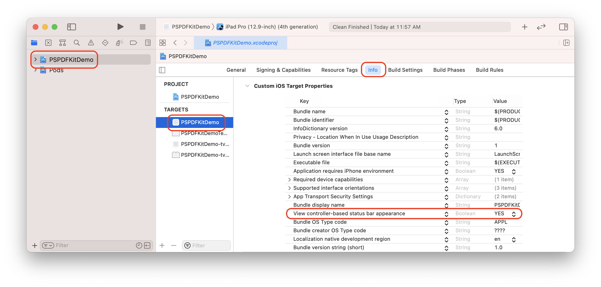

## PSPDFKit for React Native

### iOS

#### Requirements
- Xcode 8
- PSPDFKit 6
- react-native >= 0.34.1

#### Getting Started

Lets create a simple app that integrates `PSPDFKit.framework` and uses the `react-native-pspdfkit` module.

1. Make sure `react-native-cli` is installed: `npm install -g react-native-cli`
2. Create the app with `react-native init YourApp`.
3. Step into your newly created app folder: `cd YourApp`
4. Install `react-native-pspdfkit` from GitHub: `react-native install github:PSPDFKit/react-native`
5. Create the folder `ios/PSPDFKit` and copy `PSPDFKit.framework` into it.
6. Open `ios/YourApp.xcodeproj` in Xcode: `open ios/YourApp.xcodeproj`
7. Make sure the deployment target is set to 9.0 or higher:

8. Change "View controller-based status bar appearance" to `YES` in `Info.plist`:

9. Open `node_modules/react-native-pspdfkit/ios` and drag and drop `RCTPSPDFKit.xcodproj` into the YourApp Xcode project:

10. Link with the `libRCTPSPDFKit.a` static library:

11. Embed `PSPDFKit.framework` by drag and dropping it into the "Embedded Binaries" section of the "YourApp" target (Select "Create groups"). This will also add it to the "Linked Framworks and Libraries" section:

12. Add a PDF by drag and dropping it into your Xcode project (Select "Create groups" and add to target "YourApp"). This will add the document to the "Copy Bundle Resources" build phase:

13. Replace the default component from `index.ios.js` with a simple touch area to present the bundled PDF:

```javascript
import React, { Component } from 'react';
import {
  AppRegistry,
  StyleSheet,
  NativeModules,
  Text,
  TouchableHighlight,
  View
} from 'react-native';

var PSPDFKit = NativeModules.PSPDFKit;

PSPDFKit.setLicenseKey('INSERT_YOUR_LICENSE_KEY_HERE');

// Change 'YourApp' to your app's name.
class YourApp extends Component {
  _onPressButton() {
    PSPDFKit.present('document.pdf', {})
  }
  
  render() {
    return (
      <View style={styles.container}>
        <TouchableHighlight onPress={this._onPressButton}>
          <Text style={styles.text}>Tap to Open Document</Text>
        </TouchableHighlight>
      </View>
    );
  }
}

const styles = StyleSheet.create({
  container: {
    flex: 1,
    justifyContent: 'center',
    alignItems: 'center',
    backgroundColor: '#F5FCFF',
  },
  text: {
    fontSize: 20,
    textAlign: 'center',
    margin: 10,
  }
});

// Change both 'YourApp's to your app's name.
AppRegistry.registerComponent('YourApp', () => YourApp);
```

Your app is now ready to launch. Run the app in Xcode or type `react-native run-ios` in the terminal.

#### Configuration

You can configure the presentation with a configuration dictionary which is a mirror of the [`PSPDFConfiguration`](https://pspdfkit.com/api/ios/Classes/PSPDFConfiguration.html) class.

Example:

```javascript
PSPDFKit.present('document.pdf', {
  thumbnailBarMode: 'scrollable',
  pageTransition: 'scrollContinuous',
  scrollDirection: 'vertical'
})
```
  
#### Running Catalog Project

- Copy `PSPDFKit.framework` into the `PSPDFKit` directory.
- Install npm packages: `npm install` in `samples/Catalog` directory.
- Run the app with `react-native-cli`: `react-native run-ios`

## License

This project can be used for evaluation or if you have a valid PSPDFKit license.  
All items and source code Copyright © 2010-2016 PSPDFKit GmbH.

See LICENSE for details.
